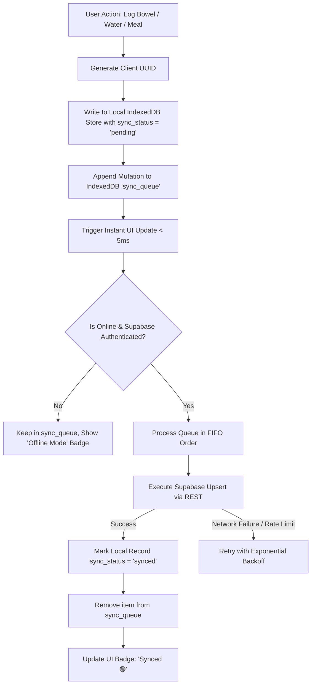

# NorthLife — API & Data Synchronization Specification

> **Version:** 1.0.0  
> **Core Principle:** Offline-First (Local-First) Architecture with IndexedDB as the primary single source of truth for the UI, backed by Supabase PostgreSQL.

---

## 1. Local IndexedDB Schema Specification

Database Name: `NorthLifeDB`  
Version: `1`

### 1.1 Object Stores & Indices

| Store Name | Primary Key (`keyPath`) | Indices | Purpose |
| :--- | :--- | :--- | :--- |
| `profiles` | `id` (UUID) | `updated_at` | User preferences, goals, theme |
| `bowel_logs` | `id` (UUID) | `log_time`, `bristol_type`, `sync_status` | Washroom, Bristol chart, pain, triggers |
| `water_logs` | `id` (UUID) | `logged_at`, `sync_status` | Hydration logs |
| `diet_logs` | `id` (UUID) | `logged_at`, `meal_type`, `sync_status` | Meal entries, calories, fiber |
| `medications` | `id` (UUID) | `is_active`, `name` | Medication master catalog & inventory |
| `medication_logs` | `id` (UUID) | `taken_at`, `medication_id`, `sync_status` | Adherence checklist logs |
| `vitals_logs` | `id` (UUID) | `logged_at`, `sync_status` | BP, weight, glucose readings |
| `habits` | `id` (UUID) | `is_active`, `category` | Custom habit catalog |
| `habit_logs` | `id` (UUID) | `habit_id`, `completed_date` | Daily streak checkboxes |
| `sleep_logs` | `id` (UUID) | `sleep_start`, `sync_status` | Sleep duration and quality |
| `mood_logs` | `id` (UUID) | `logged_at`, `sync_status` | Mood and stress logs |
| `sync_queue` | `queue_id` (auto-increment) | `created_at`, `table_name`, `status` | Pending mutations to sync to Supabase |

---

## 2. Sync Engine & Queue Architecture



### 2.1 Sync Queue Record Structure
```json
{
  "queue_id": 1024,
  "action": "UPSERT", // "UPSERT" | "DELETE"
  "table_name": "bowel_health_logs",
  "record_id": "8f3e2d1c-4b5a-6789-0123-abcdef456789",
  "payload": {
    "id": "8f3e2d1c-4b5a-6789-0123-abcdef456789",
    "user_id": "auth-uuid-here",
    "log_time": "2026-09-14T12:30:00.000Z",
    "bristol_type": 4,
    "pain_level": 0,
    "bleeding_observed": false,
    "triggers": ["spicy_food"],
    "created_at": "2026-09-14T12:30:00.000Z"
  },
  "created_at": "2026-09-14T12:30:00.000Z",
  "retry_count": 0,
  "status": "pending"
}
```

### 2.2 Conflict Resolution Strategy
* **Last-Write-Wins (LWW) with Client Timestamps:** When syncing a record, if the remote server has a newer `updated_at` timestamp, the remote record updates the local store. Otherwise, local unpushed changes take precedence.
* **Idempotent Upserts:** All insertions use Supabase `upsert({ ... }, { onConflict: 'id' })` keyed by the client-generated UUID.

---

## 3. Web Push & Notification Engine

* **Local Notification Broker:**
  * Uses `Notification.requestPermission()` and the Service Worker `showNotification()`.
  * Checks scheduled timers every 60 seconds via `setInterval` and Service Worker alarms.
* **Email Notification Dispatcher (Optional):**
  * Invokes Supabase Edge Function `/functions/v1/send-alert-email` for low-stock medicine warnings when online.
