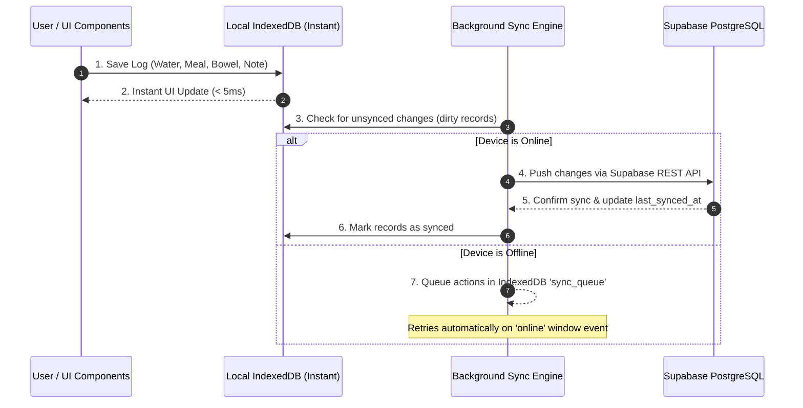

# Product Requirements Document (PRD) — NorthLife

**Project Name:** NorthLife  
**Tagline:** Privacy-First, Offline-Capable Modular Personal Operating System & Health Manager  
**Architecture:** Offline-First Modular Single Page Application (PWA)  
**Hosting & Frontend:** GitHub Pages (Pure Semantic HTML5, Custom Pure CSS3, Modular Vanilla ES6+ JS — **Zero external CDN dependencies**, **Strictly Manrope typography**, Warm Alabaster & Signature Pastel Design System)  
**Backend & Database:** Supabase (PostgreSQL, Supabase Auth, Row Level Security, Edge Functions, Storage)  
**Local Storage & Offline Engine:** IndexedDB + Service Worker PWA  
**Document Version:** 2.2.0  
**Date:** September 2026  

---

## 1. Vision & Architectural Paradigm

### 1.1 The "NorthLife" Platform Concept
Rather than being a rigid, single-purpose health app, **NorthLife** is built as a lightweight, privacy-focused, **pluggable modular personal operating system**.
* **The Core Shell:** Handles Authentication, IndexedDB Local Cache & Cloud Sync Engine, PWA Service Worker, Theme Engine, Notification Dispatcher, and the Plugin/Module Registry.
* **Pluggable Architecture:** Every feature (Health & Digestive Care, Finance, Notes, Vault, AI Insights) is an isolated module that hooks into the Core Shell lifecycle (`init()`, `render()`, `sync()`, `destroy()`).
* **Zero External CDN / Fully Self-Contained:** All CSS, icons, fonts, and JS libraries are stored locally in the repository. The app loads instantly, even completely offline.
* **Offline-First via IndexedDB + Service Worker:** All user actions write instantly to local IndexedDB (zero UI latency, `< 5ms`). A background sync manager syncs changes with Supabase when internet connectivity is available.

---

## 2. Core Architecture & Stack

```
+---------------------------------------------------------------------------------+
|                                NorthLife PWA SHELL                              |
|                                                                                 |
|  +---------------------------------------------------------------------------+  |
|  | Core Platform Services:                                                    |  |
|  | - Plugin/Module Registry (Dynamic Tab & Dashboard Loader)                 |  |
|  | - Sync Engine (Supabase <---> IndexedDB Bidirectional Offline-First Sync)|  |
|  | - Notification Broker (Browser Push, Audio Chimes, Supabase Email Trigger)|  |
|  | - Security & Crypto Vault (AES-GCM for sensitive data / password vault)  |  |
|  | - Local Asset Engine (Vendored local JS/CSS/Fonts - Zero External CDNs)   |  |
|  +---------------------------------------------------------------------------+  |
|                                                                                 |
|  +---------------------------------------------------------------------------+  |
|  | Pluggable Life Modules:                                                    |  |
|  |  [ Health & Vitals ]  [ Bowel/Digestive ]   [ Doctor Mode Export ]         |  |
|  |  [ AI Insights Slot]  [ Wearables Slot  ]   [ Notes & Docs Vault ]         |  |
|  |  [ Finance/Expenses]  [ Passwords Vault ]   [ Tasks & Routines   ]         |  |
|  +---------------------------------------------------------------------------+  |
+----------------------------------------+----------------------------------------+
                                         | Sync Queue (Online/Offline)
+----------------------------------------v----------------------------------------+
|                               SUPABASE BACKEND                                  |
|  - PostgreSQL with Row Level Security (RLS) for all modules                     |
|  - Supabase Auth (Email magic links / Password / Google OAuth)                  |
|  - Supabase Edge Functions (Email alerts, scheduled crons, AI Gateway proxy)   |
|  - Supabase Storage (Encrypted lab records, invoices, PDFs)                     |
+---------------------------------------------------------------------------------+
```

---

## 3. Core NorthLife Modules (Current & Future Slots)

### 3.1 Module 1: Health & Lifestyle Core
* **Today's Executive Dashboard:**
  * Hydration Progress Ring (Current vs Daily Target).
  * Nutrition & Fiber Tracker (Calories, Protein, Carbs, Fat, Fiber intake).
  * Medication & Supplement Checklist (Time-scheduled morning/afternoon/night slots with stock countdown).
  * Weight, BP, and Vitals Log.
  * Habits & Daily Streaks (Custom routines like morning warm water, walks, pelvic floor exercises).
  * Sleep & Recovery Journal (Bedtime, Wake time, Duration, Interruptions, Quality score).
  * Mood & Stress Journal (1–5 scale + energy level + micro-journaling).
  * Appointments & Lab Records Vault.

---

### 3.2 Module 2: Digestive & Bowel Health (Specialized Care)
* **Washroom Visit Tracker:** Time, duration in minutes, status (Done / Incomplete / Straining).
* **Bristol Stool Chart Visual Selector:** Types 1 to 7 with clear visual cues and consistency notes.
* **Pain & Discomfort Tracker:** 0–10 severity scale + pain type (Cramping, Burning, Sharp, Rectal Pressure, Bloating).
* **Bleeding & Severity Indicator:** Checkbox toggle + classification (Streaks, in bowl, mixed, heavy).
* **Lifestyle & Dietary Triggers Checklist:** Multi-tag selector (Spicy food, prolonged sitting >2h, heavy weightlifting, dehydration, high caffeine, dairy, stress).
* **Fiber & Water Intake Cross-Analysis:** Correlates flare-up days with logged dietary fiber and water levels.

---

### 3.3 Module 3: "Doctor Mode" Clinical PDF Exporter
* **One-Click 30 / 60 / 90-Day Clinical Summary:**
  * Clean, printable medical document formatted for doctor consultations.
  * Bristol stool distribution, pain & bleeding episode frequencies, trigger correlations.
  * Medication adherence percentages and vitals timeline.
  * **Explicit Medical Disclaimer:** *"This document is a patient self-reported behavioral and symptom log for clinical discussion only. It does not provide medical diagnosis or therapeutic claims."*
  * Uses local vendored PDF generation library (`jspdf.min.js`).

---

### 3.4 Module 4: Future AI Assistant & Insights Slot
* **AI Architecture:** Extensible integration hook designed for BYOK (Bring Your Own API Key - OpenAI / Gemini / Anthropic / Local WebLLM) or Supabase Edge Function proxy.
* **Key Capabilities:**
  * **Symptom & Trigger Pattern Recognition:** *"On days you sat >3 hours and drank <2L water, pain scores increased by 40%."*
  * **Dietary Fiber Suggestions:** Identifies low-fiber days and suggests gut-friendly meal additions.
  * **Natural Language Logging:** Ability to type or dictate *"Ate 2 rotis with dal and salad, drank 500ml water"* and auto-parse into meal logs.

---

### 3.5 Module 5: Future Wearable & Device Integration Slot
* **Architecture:** Abstracted `WearableAdapter` interface.
* **Supported Integrations (Planned):** Google Fit REST API, Apple Health export parser, Web Bluetooth heart rate monitors, Fitbit API.
* **Syncable Metrics:** Daily steps, resting heart rate, active calories, sleep stages.

---

### 3.6 Module 6: Future NorthLife Extensions (Non-Health)
* **Finance & Expense Log:** Daily expenses, income, category splits, monthly budget tracking.
* **Notes & Daily Logbook:** Markdown-supported offline notes with tag-based search.
* **Encrypted Password & Secret Vault:** Client-side AES-GCM encrypted credential storage (Zero-Knowledge: master key never leaves the browser).
* **Document & Warranty Vault:** Encrypted storage of IDs, insurance cards, invoices, and certificates.

---

## 4. Notifications & Communication Engine

1. **In-Browser & PWA Push Notifications:**
   * Uses Web Notification API + Service Worker Background Sync.
   * Audio chimes for hydration and medication reminders.
   * Works even when tab is in background (when installed as PWA).
2. **Email Alerts (Optional via Supabase):**
   * Supabase Database Webhook / Edge Function configured to send email reminders (via Resend or SMTP) for:
     * Critical medication low-stock alerts.
     * Weekly health summary digests.
     * Upcoming doctor appointments.

---

## 5. Offline-First Data & Synchronization Strategy



---

## 6. Database Schema (PostgreSQL with NorthLife Namespaces)

```sql
-- =========================================================================
-- NORTHLIFE CORE TABLES
-- =========================================================================

-- 1. User Profile & System Preferences
CREATE TABLE profiles (
    id UUID PRIMARY KEY REFERENCES auth.users(id) ON DELETE CASCADE,
    full_name TEXT,
    date_of_birth DATE,
    gender TEXT,
    height_cm NUMERIC(5,2),
    target_weight_kg NUMERIC(5,2),
    daily_water_goal_ml INT DEFAULT 3000,
    daily_calorie_goal INT DEFAULT 2000,
    daily_fiber_goal_g INT DEFAULT 35,
    theme_preference TEXT DEFAULT 'dark',
    enabled_modules TEXT[] DEFAULT ARRAY['health', 'digestive', 'doctor_mode'],
    notification_settings JSONB DEFAULT '{"water_interval_mins": 60, "email_alerts": false}'::JSONB,
    created_at TIMESTAMPTZ DEFAULT NOW(),
    updated_at TIMESTAMPTZ DEFAULT NOW()
);

-- =========================================================================
-- HEALTH & DIGESTIVE MODULE TABLES
-- =========================================================================

-- 2. Bowel & Digestive Health Log
CREATE TABLE bowel_health_logs (
    id UUID PRIMARY KEY DEFAULT gen_random_uuid(),
    user_id UUID NOT NULL REFERENCES profiles(id) ON DELETE CASCADE,
    log_time TIMESTAMPTZ DEFAULT NOW(),
    duration_minutes INT DEFAULT 5,
    is_completed BOOLEAN DEFAULT TRUE,
    bristol_type INT CHECK (bristol_type BETWEEN 1 AND 7),
    pain_level INT CHECK (pain_level BETWEEN 0 AND 10) DEFAULT 0,
    pain_type TEXT,
    bleeding_observed BOOLEAN DEFAULT FALSE,
    bleeding_severity TEXT, -- 'none', 'streaks', 'in_bowl', 'heavy'
    triggers TEXT[], -- ARRAY['spicy_food', 'sitting_prolonged', 'heavy_lifting', 'low_water']
    notes TEXT,
    synced_at TIMESTAMPTZ DEFAULT NOW(),
    created_at TIMESTAMPTZ DEFAULT NOW()
);

-- 3. Hydration Logs
CREATE TABLE water_logs (
    id UUID PRIMARY KEY DEFAULT gen_random_uuid(),
    user_id UUID NOT NULL REFERENCES profiles(id) ON DELETE CASCADE,
    amount_ml INT NOT NULL,
    logged_at TIMESTAMPTZ DEFAULT NOW()
);

-- 4. Nutrition & Diet Logs
CREATE TABLE diet_logs (
    id UUID PRIMARY KEY DEFAULT gen_random_uuid(),
    user_id UUID NOT NULL REFERENCES profiles(id) ON DELETE CASCADE,
    meal_type TEXT NOT NULL, -- 'breakfast', 'lunch', 'dinner', 'snack'
    food_items TEXT NOT NULL,
    calories INT DEFAULT 0,
    protein_g NUMERIC(5,1) DEFAULT 0,
    carbs_g NUMERIC(5,1) DEFAULT 0,
    fats_g NUMERIC(5,1) DEFAULT 0,
    fiber_g NUMERIC(5,1) DEFAULT 0,
    is_spicy BOOLEAN DEFAULT FALSE,
    logged_at TIMESTAMPTZ DEFAULT NOW()
);

-- 5. Medications & Adherence Logs
CREATE TABLE medications (
    id UUID PRIMARY KEY DEFAULT gen_random_uuid(),
    user_id UUID NOT NULL REFERENCES profiles(id) ON DELETE CASCADE,
    name TEXT NOT NULL,
    dosage TEXT NOT NULL,
    frequency TEXT NOT NULL,
    scheduled_times TIME[],
    stock_count INT DEFAULT 0,
    low_stock_threshold INT DEFAULT 5,
    is_active BOOLEAN DEFAULT TRUE,
    created_at TIMESTAMPTZ DEFAULT NOW()
);

CREATE TABLE medication_logs (
    id UUID PRIMARY KEY DEFAULT gen_random_uuid(),
    medication_id UUID REFERENCES medications(id) ON DELETE CASCADE,
    user_id UUID NOT NULL REFERENCES profiles(id) ON DELETE CASCADE,
    taken_at TIMESTAMPTZ DEFAULT NOW(),
    status TEXT DEFAULT 'taken'
);

-- 6. Vitals & Weight Logs
CREATE TABLE vitals_logs (
    id UUID PRIMARY KEY DEFAULT gen_random_uuid(),
    user_id UUID NOT NULL REFERENCES profiles(id) ON DELETE CASCADE,
    weight_kg NUMERIC(5,2),
    systolic_bp INT,
    diastolic_bp INT,
    pulse_bpm INT,
    blood_sugar_mg_dl NUMERIC(5,1),
    logged_at TIMESTAMPTZ DEFAULT NOW()
);

-- 7. Habits & Routines
CREATE TABLE habits (
    id UUID PRIMARY KEY DEFAULT gen_random_uuid(),
    user_id UUID NOT NULL REFERENCES profiles(id) ON DELETE CASCADE,
    title TEXT NOT NULL,
    category TEXT,
    target_days_per_week INT DEFAULT 7,
    is_active BOOLEAN DEFAULT TRUE,
    created_at TIMESTAMPTZ DEFAULT NOW()
);

CREATE TABLE habit_logs (
    id UUID PRIMARY KEY DEFAULT gen_random_uuid(),
    habit_id UUID REFERENCES habits(id) ON DELETE CASCADE,
    user_id UUID NOT NULL REFERENCES profiles(id) ON DELETE CASCADE,
    completed_date DATE NOT NULL DEFAULT CURRENT_DATE,
    created_at TIMESTAMPTZ DEFAULT NOW(),
    UNIQUE(habit_id, completed_date)
);

-- 8. Sleep & Mood Logs
CREATE TABLE sleep_logs (
    id UUID PRIMARY KEY DEFAULT gen_random_uuid(),
    user_id UUID NOT NULL REFERENCES profiles(id) ON DELETE CASCADE,
    sleep_start TIMESTAMPTZ NOT NULL,
    sleep_end TIMESTAMPTZ NOT NULL,
    duration_hours NUMERIC(4,2),
    quality_rating INT CHECK (quality_rating BETWEEN 1 AND 5),
    notes TEXT,
    logged_at TIMESTAMPTZ DEFAULT NOW()
);

CREATE TABLE mood_logs (
    id UUID PRIMARY KEY DEFAULT gen_random_uuid(),
    user_id UUID NOT NULL REFERENCES profiles(id) ON DELETE CASCADE,
    mood_score INT CHECK (mood_score BETWEEN 1 AND 5),
    stress_level INT CHECK (stress_level BETWEEN 1 AND 5),
    energy_level INT CHECK (energy_level BETWEEN 1 AND 5),
    journal_entry TEXT,
    logged_at TIMESTAMPTZ DEFAULT NOW()
);

-- =========================================================================
-- FUTURE NORTHLIFE MODULE TABLES (PRE-PROVISIONED SLOTS)
-- =========================================================================

-- 9. Future Slot: Encrypted Notes & Life Logbook
CREATE TABLE life_notes (
    id UUID PRIMARY KEY DEFAULT gen_random_uuid(),
    user_id UUID NOT NULL REFERENCES profiles(id) ON DELETE CASCADE,
    title TEXT NOT NULL,
    content TEXT,
    tags TEXT[],
    is_pinned BOOLEAN DEFAULT FALSE,
    updated_at TIMESTAMPTZ DEFAULT NOW(),
    created_at TIMESTAMPTZ DEFAULT NOW()
);

-- 10. Future Slot: Personal Finance Tracker
CREATE TABLE finance_transactions (
    id UUID PRIMARY KEY DEFAULT gen_random_uuid(),
    user_id UUID NOT NULL REFERENCES profiles(id) ON DELETE CASCADE,
    amount NUMERIC(10,2) NOT NULL,
    type TEXT NOT NULL, -- 'expense', 'income'
    category TEXT NOT NULL,
    notes TEXT,
    transaction_date DATE NOT NULL DEFAULT CURRENT_DATE,
    created_at TIMESTAMPTZ DEFAULT NOW()
);
```

---

## 7. Self-Contained Project Directory Structure (No CDNs)

```
NorthLife/
├── index.html                      # NorthLife Single Page App Shell
├── manifest.json                   # PWA Manifest (Install to Home Screen)
├── sw.js                           # Service Worker (Offline Cache & Sync)
│
├── assets/
│   ├── css/
│   │   ├── reset.css               # Clean modern CSS reset
│   │   ├── variables.css           # Design tokens (Dark/Light colors, typography)
│   │   ├── layout.css              # Grid, sidebar, responsive shell
│   │   ├── components.css          # Cards, buttons, inputs, modals, toasts
│   │   └── modules/                # Module-specific styles
│   │       ├── health.css          # Health dashboards & rings
│   │       ├── bowel.css           # Bristol Stool Chart & trigger UI
│   │       └── doctor_mode.css     # PDF export print layout
│   │
│   ├── js/
│   │   ├── app.js                  # NorthLife Core bootstrap & router
│   │   ├── config.js               # Supabase config & app constants
│   │   │
│   │   ├── vendor/                 # 100% LOCAL LIBRARIES (Zero external CDNs)
│   │   │   ├── supabase.js         # Vendored local Supabase JS client
│   │   │   ├── chart.min.js        # Vendored lightweight charting library
│   │   │   └── jspdf.min.js        # Vendored client-side PDF generator
│   │   │
│   │   ├── core/                   # Core System Engine
│   │   │   ├── auth.js             # Supabase Auth manager
│   │   │   ├── idb.js              # IndexedDB local storage engine
│   │   │   ├── sync.js             # Online/Offline bidirectional sync engine
│   │   │   ├── router.js           # Lightweight hash/view router
│   │   │   ├── notifications.js    # Web push & audio reminder broker
│   │   │   └── moduleRegistry.js   # NorthLife Pluggable Module Manager
│   │   │
│   │   └── modules/                # Pluggable Feature Modules
│   │       ├── health/             # Health & Lifestyle Core
│   │       │   ├── dashboard.js    # "Today" summary overview
│   │       │   ├── bowelHealth.js  # Bristol chart, pain/bleeding, triggers
│   │       │   ├── water.js        # Water log & smart timer
│   │       │   ├── diet.js         # Diet planner & fiber focus
│   │       │   ├── medications.js  # Med checklist & low stock alert
│   │       │   ├── vitals.js       # BP, sugar, weight tracker
│   │       │   ├── habits.js       # Habit streaks
│   │       │   ├── sleepMood.js    # Sleep & mood journals
│   │       │   └── doctorMode.js   # 30-90 day PDF generation
│   │       │
│   │       ├── ai/                 # [Future Slot] AI Pattern Insights
│   │       │   └── aiInsights.js   # Correlation analysis engine
│   │       │
│   │       ├── wearables/          # [Future Slot] Wearables Adapter
│   │       │   └── fitAdapter.js   # Google Fit / HealthKit interface
│   │       │
│   │       ├── notes/              # [Future Slot] Life Notes
│   │       │   └── notesModule.js  # Markdown notes manager
│   │       │
│   │       └── finance/            # [Future Slot] Personal Finance
│   │           └── financeModule.js# Expense & budget tracker
│   │
│   ├── icons/                      # Local SVG icon sprites (Zero font CDN)
│   └── sounds/                     # Local notification audio (chime.mp3)
│
├── sql/
│   ├── schema.sql                  # Full Postgres schema
│   └── rls_policies.sql            # Row-level security definitions
│
├── README.md                       # Setup & GitHub Pages Deployment Guide
└── PRD.md                          # This Document
```

---

## 8. Pluggable Module Architecture Contract

Every module implements a unified lifecycle contract:

```javascript
// Example NorthLife Module Contract
export const BowelHealthModule = {
  id: 'bowel_health',
  name: 'Bowel & Digestive Health',
  category: 'health',
  icon: 'icon-digestive',
  
  async init() {
    // 1. Initialize IndexedDB table / store
    // 2. Register reminder hooks if any
  },
  
  async render(containerElement) {
    // Render the view into the DOM
  },
  
  async sync() {
    // Sync local changes to Supabase
  },
  
  destroy() {
    // Cleanup listeners / timers when navigating away
  }
};
```

---

## 9. Phased Implementation Plan

### Phase 1: NorthLife Core Platform & Offline Shell (Day 1)
* Pure Semantic HTML5 layout with Custom CSS3 Design System (Dark/Light mode, responsive).
* Vendored local libraries (`supabase.js`, `chart.min.js`, `jspdf.min.js`) — **Zero CDNs**.
* IndexedDB storage wrapper + Service Worker for 100% offline capability.
* Supabase Auth integration (Email/Google) + Offline session caching.
* Pluggable Module Registry and navigation router.

### Phase 2: Health Core & Digestive Health Module (Day 2)
* "Today" Dashboard with real-time IndexedDB writes and instant UI updates.
* Dedicated Digestive/Bowel Health logging (Bristol Stool Chart visual selector, pain 0–10, bleeding, triggers: spicy, sitting, dehydration, heavy lifting).
* Water tracker with in-browser audio chime and notification triggers.
* Fiber & Nutrition tracker with trigger-symptom correlation.

### Phase 3: Meds, Habits & "Doctor Mode" PDF (Day 3)
* Medication manager with daily timed schedule & inventory tracking.
* Habits, Sleep, and Vitals trackers.
* "Doctor Mode" one-click clinical PDF generator (30/60/90 days summary with medical disclaimer).
* JSON/CSV Full Data Backup & Restore.

### Phase 4: Future Expansion Slots Ready & Deployment (Day 4)
* Notification broker with Email option (Supabase Edge Function / webhook support).
* AI Pattern Insights adapter slot & Wearables adapter interface scaffolding.
* Notes & Finance module slot preparation.
* GitHub Pages deployment & PWA installation verification.
