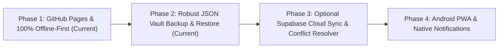

# 🛡️ NorthLife Principles & Engineering Manifest

> *"Discipline is what makes a health system premium — not gradients, glassmorphism, or cartoon badges."*

This document serves as the constitutional design and engineering guide for NorthLife. Every feature, pull request, UI element, and architectural decision must strictly comply with these core tenets.

---

## 🏛️ The 10 Foundational Principles

### 1. 📴 Offline-First by Architecture
- The application must be 100% functional without an active internet connection.
- All core health data, attachments, and settings reside directly inside the user's browser via IndexedDB.
- No network failure or server outage should ever prevent a user from logging medication, water, food, or vitals.

### 2. 🔓 Zero Mandatory Login
- Users must never be blocked by a signup wall, email verification, or OAuth prompt.
- The app is immediately usable from second zero (`Continue Offline` is always the primary action).
- Authentication is strictly an optional layer for users who deliberately choose multi-device cloud synchronization.

### 3. ↩️ Every Action is Reversible (Zero Data Anxiety)
- Destructive actions (deletions, clears, updates) must provide an immediate inline **Undo** mechanism (e.g., 6-second floating toast with one-click restore).
- Deleting an entry must never cause permanent instant panic.
- Backups and restores must be non-destructive and predictable.

### 4. 🧠 Minimal Cognitive Load (Calm, Dignified Health)
- Health tracking is for personal wellness, not for dopamine loops.
- No frantic red alert banners, no gamified cartoon badges, no fake streaks, and no sensory clutter.
- The interface must feel like a refined clinical leather journal: serene, typography-first, structured, and intentional.

### 5. ♿ Accessibility & Universal Usability First
- Clean semantic HTML, high-contrast readable typefaces (`Geist Mono`, `Manrope`, `Instrument Serif`), standard ARIA labels, full keyboard navigation (`Ctrl+K` for search, `L` for universal log, `Esc` to close modals), and responsive touch targets (minimum 44px on mobile).

### 6. 🗄️ Uncompromising Data Ownership & Portability
- The user owns 100% of their medical and lifestyle data.
- 1-click **JSON Vault Export** produces a clean, human-readable, unencrypted or encrypted open JSON schema containing all logs, tags, attachments, and vitals.
- 1-click **JSON Import** restores the entire database effortlessly on any browser or device.

### 7. 🔒 Zero Telemetry & Absolute Privacy
- Zero Google Analytics, zero Facebook Pixels, zero third-party trackers, and zero telemetry beacons.
- Health data is intimate and sacred. What is logged in NorthLife stays strictly on the client hardware.

### 8. 🔀 Transparent Sync & Non-Destructive Conflict Resolution
- When cloud synchronization (Phase 3) is introduced, the app must **never silently overwrite or delete local data**.
- If local records exist upon login, the user must always be presented with an explicit, crystal-clear decision modal:
  1. **Merge Local & Cloud Data** (Recommended — unites records by UUID/timestamps)
  2. **Keep Local Only** (Overwrites cloud vault)
  3. **Restore from Cloud** (Replaces local cache with remote account)
- Users must never be left wondering *"Did the app eat my data?"*

### 9. 🧩 Unified Common Entry Model (No Fragmentation)
- All health events (water, meals, bowel logs, vitals, prescriptions, doctor notes) share a unified data schema (`health_entries`).
- Avoid creating dozens of isolated subpages for every minor metric. Consolidate into cohesive hubs (e.g. Nutrition Hub for calories + protein + fiber).

### 10. ⚡ Instant Performance & Zero Bloat
- Zero heavy JavaScript frameworks, zero massive UI libraries.
- Pure native Vanilla JS and standard CSS variables for 60 FPS fluidity, instant page loads (<100ms), and tiny bundle footprint.

---

## 🧭 The Feature Decision Filter

Before proposing, designing, or implementing any new feature, answer these questions:

```
┌────────────────────────────────────────────────────────────────────────┐
│                      THE NORTHLIFE DECISION FILTER                     │
└────────────────────────────────────────────────────────────────────────┘
                                    │
  [1] Does it work 100% offline without an external API?
      ├── NO  ──► ❌ REJECT / REDESIGN FOR LOCAL STORAGE
      └── YES ──► Continue
                                    │
  [2] Does it require mandatory account registration to test/use?
      ├── YES ──► ❌ REJECT (Make login optional/secondary)
      └── NO  ──► Continue
                                    │
  [3] Is the action reversible with an Undo or confirmation guard?
      ├── NO  ──► ❌ REJECT (Add Undo / Non-destructive restore)
      └── YES ──► Continue
                                    │
  [4] Does it add visual noise, gaming badges, or fake numbers?
      ├── YES ──► ❌ REJECT (Keep calm, clinical, dignified)
      └── NO  ──► Continue
                                    │
  [5] Can this data be exported and imported via standard JSON?
      ├── NO  ──► ❌ REJECT (Standardize into Common Entry Model)
      └── YES ──► ✅ APPROVED FOR IMPLEMENTATION
```

---

## 🗺️ The 4-Phase Sustainable Roadmap



### 📍 Phase 1 — GitHub Pages & 100% Offline-First *(Current)*
- Pure client-side static deploy on GitHub Pages.
- Full IndexedDB storage for water, nutrition, digestive care, custom vitals, prescriptions, doctor notes, and attachments.
- Zero server dependency, instant double-click local execution.

### 📍 Phase 2 — JSON Backup & Seamless Data Portability *(Current)*
- 1-Click JSON Health Vault export containing all logs, tags, attachments (Base64), and user metrics.
- 1-Click JSON Health Vault import with schema validation and zero data loss.
- Full privacy with zero signup required.

### 📍 Phase 3 — Optional Supabase Backend & Multi-Device Cloud Sync *(Upcoming)*
- Homepage onboarding dual-choice:
  - `Continue Offline` (Primary — instantaneous zero-friction entry)
  - `Sign In & Sync` (Secondary — Supabase Auth: Email / Magic Link)
- 3-Way Cloud Sync Conflict Resolver (Merge vs Replace Local vs Overwrite Cloud).
- Minimalist Sync Status Badge in Settings and Header (`● 100% Offline Vault` or `☁️ Synced to Supabase`).

### 📍 Phase 4 — Android PWA & Timely Push Scheduling *(Future)*
- Progressive Web App (PWA) manifest with Web Push Notifications for daily medication reminders and water intervals.
- Background sync and offline cache service workers.

---

*NorthLife Core Philosophy: Pure Data Dignity, Zero Fluff, Total Privacy.*
